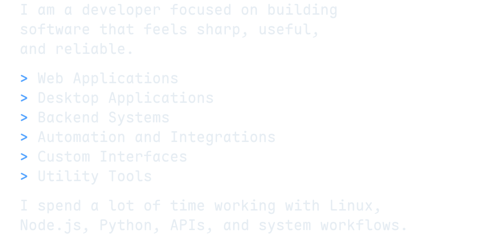
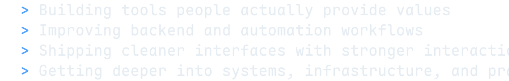
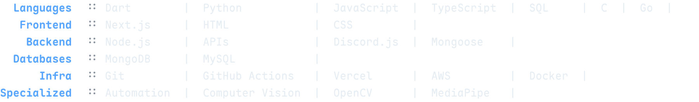
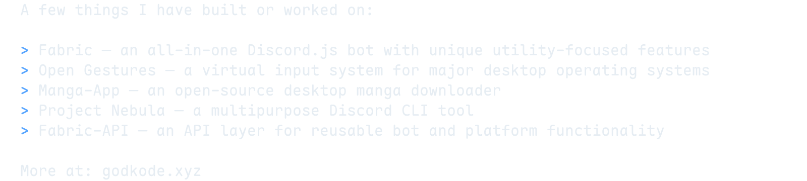
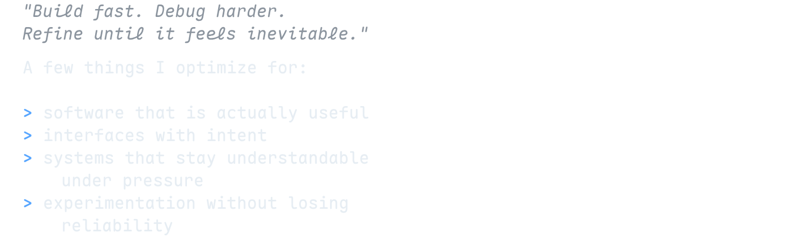
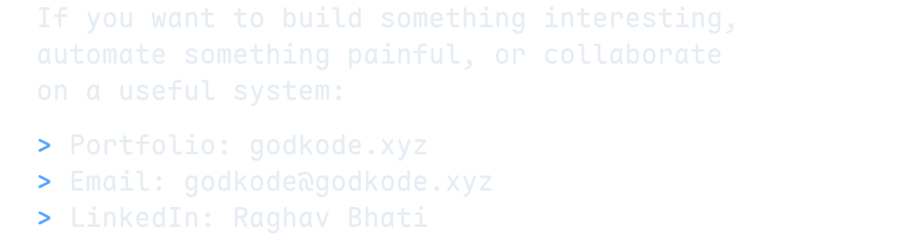

  

  
  &nbsp;&nbsp;
  
  &nbsp;&nbsp;
  
  &nbsp;&nbsp;
  
  &nbsp;&nbsp;
  
  &nbsp;&nbsp;
  

---

 

  
  
  

---

  

  

---

  

  

---

  

  

---

  

  

---

  

  

---

  

  

---
