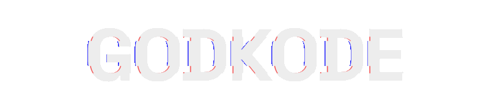

<p align="center">
  <a href="#readme">
    
  </a>
</p>

<p align="center">
  <a href="https://godkode.xyz">Portfolio</a> •
  <a href="https://www.linkedin.com/in/raghav-bhati-a22349365/">LinkedIn</a> •
  <a href="mailto:godkode@godkode.xyz">Email</a>
</p>

---

<br>

<p align="center">
  
  
  
</p>

---

<p align="center">
  
</p>

I am a developer focused on building software that feels sharp, useful, and reliable.

I mostly work around:
- Web Applications
- Desktop Applications
- Backend Systems
- Automation and Integrations
- Custom Interfaces
- Utility Tools

<br>

I spend a lot of time working with Linux, Node.js, Python, APIs, and system workflows.

---

<p align="center">
  
</p>

- Building tools people actually provide values
- Improving backend and automation workflows
- Shipping cleaner interfaces with stronger interaction design
- Getting deeper into systems, infrastructure, and practical product engineering

---

<p align="center">
  
</p>

```txt
Languages    :: JavaScript, Python, SQL, TypeScript, C, Go
Frontend     :: Next.js, HTML, CSS
Backend      :: Node.js, APIs, Discord.js, Mongoose
Databases    :: MongoDB, MySQL
Infra        :: Git, GitHub Actions, Vercel, AWS, Containerization
Specialized  :: Automation, Computer Vision, OpenCV, MediaPipe
```

---

<p align="center">
  
</p>

A few things I have built or worked on:
- **Fabric**: an all-in-one Discord.js bot with unique utility-focused features
- **Open Gestures**: a virtual input system for major desktop operating systems
- **Manga-App**: an open-source desktop manga downloader
- **Project Nebula**: a multipurpose Discord CLI tool
- **Fabric-API**: an API layer for reusable bot and platform functionality

<br>

More at: **[godkode.xyz](https://godkode.xyz)**

---

<p align="center">
  
</p>

> Build fast. Debug harder. Refine until it feels inevitable.

A few things I optimize for:
- software that is actually useful
- interfaces with intent
- systems that stay understandable under pressure
- experimentation without losing reliability

---

<p align="center">
  
</p>

If you want to build something interesting, automate something painful, or collaborate on a useful system:

- Portfolio: [godkode.xyz](https://godkode.xyz)
- Email: [godkode@godkode.xyz](mailto:godkode@godkode.xyz)
- LinkedIn: [Raghav Bhati](https://www.linkedin.com/in/raghav-bhati-a22349365/)

---